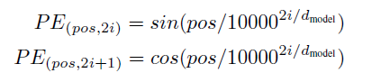
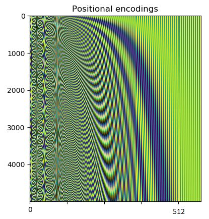
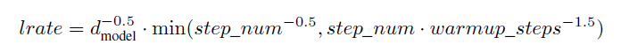
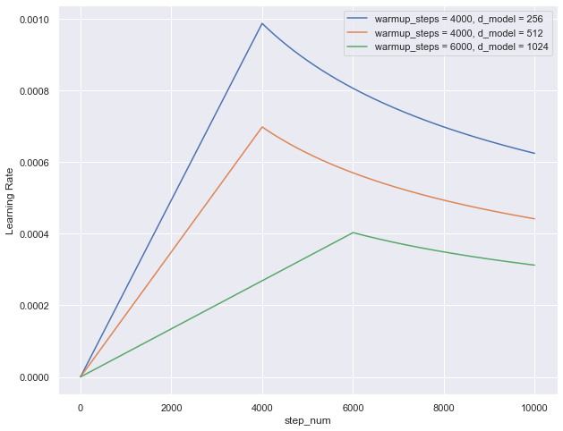
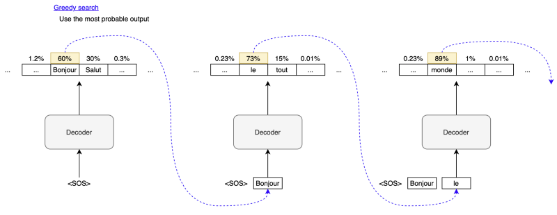
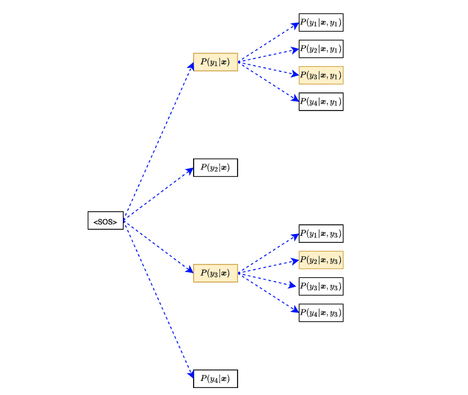
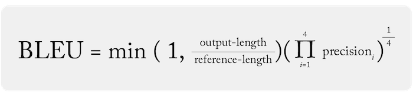
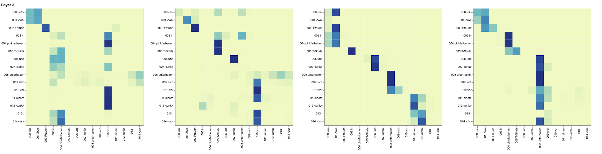
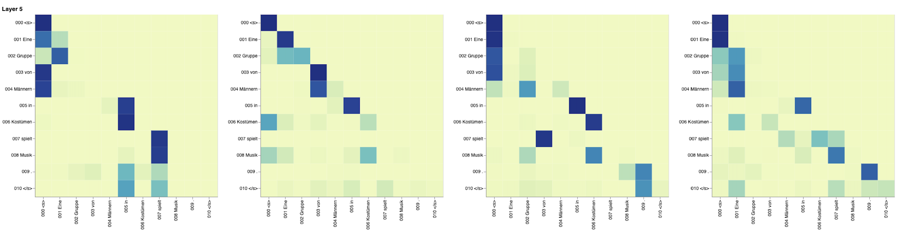

## Implementation of the "Attention is all you Need" 📝 Transformer model Ⓜ️ (Vaswani et al.) in Tensorflow.

This repo contains Tensorflow implementation of the original transformer paper (:link: [Vaswani et al.](https://arxiv.org/abs/1706.03762)). <br/>

Also Check out my 10 part LLM Blog series on (:link: [Medium](https://medium.com/@zaiinn440))

## Table of Contents
  * [What are transformers?](#what-are-transformers)
  * [Positional Encodings](#positional-encodings)
  * [Custom Learning Rate Schedule](#custom-learning-rate-schedule)
  * [Greedy and Beam Search Decoding](#greedy-and-beam-search-decoding)
  * [Machine translation](#machine-translation)
  * [Evaluation](#evaluation)
  * [Setup](#setup)
  * [Todos](#todos)
  * [Acknowledgements](#acknowledgements)
  * [Citation](#citation)
  * [Connect with me](#connect-with-me)

## What are transformers

In 2017, Vaswani et al. published a paper titled [Attention Is All You Need](https://arxiv.org/pdf/1706.03762.pdf) for the NeurIPS conference. They introduced the original transformer architecture for machine translation, performing better and faster than RNN encoder-decoder models, which were mainstream.

The transformer architecture is the basis for recent well-known models like BERT and GPT-3. Researchers have already applied the transformer architecture in Computer Vision and Reinforcement Learning. So, understanding the transformer architecture is crucial if anybody wants to know where machine learning is heading.

Transformer architecture:

<p align="center">

</p>

The main idea is that they showed that you don't have to use recurrent or convolutional layers and that simple architecture coupled with attention is super powerful. It gave the benefit of **much better long-range dependency modeling** and the architecture itself is highly **parallelizable** which leads to better compute efficiency!


## Positional Encodings

 Positional encodings are a crucial component in the Transformer architecture, specifically in the context of natural language processing tasks like machine translation. Since the Transformer model lacks any inherent notion of sequence order, it is unable to differentiate between words solely based on their positions in the input sequence. This limitation could be detrimental to its performance in tasks where word order is significant. To address this issue, the authors propose using positional encodings. Positional encodings are vectors added to the embeddings of each word, providing the model with information about their positions in the input sequence. By incorporating these positional encodings, the Transformer can distinguish between words based on both their inherent semantic content and their positions, allowing it to capture the sequential relationships crucial for understanding natural language.

<p align="center">

</p>

Positional encodings are typically calculated using trigonometric functions such as sine and cosine to create distinct and learnable encodings for different positions in the sequence. These encodings are then added to the word embeddings before being fed into the Transformer model.

```python

import matplotlib.pyplot as plt

pos = np.arange(MAX_SEQ_LEN)[:, np.newaxis]
div_term = np.exp(np.arange(0, d_model, 2) * (-math.log(10000.0) / d_model))

PE[:, 0::2] = np.sin(pos * div_term)
PE[:, 1::2] = np.cos(pos * div_term)

im = plt.imshow(PE, aspect=’auto’)

plt.title(“Positional Encoding”)
plt.xlabel(“Encoding Dimension”)
plt.ylabel(“Position Index”)
plt.colorbar(im)
plt.show()

```

<p align="center">

</p>


## Custom Learning Rate Schedule

In the context of learning rate scheduling in the "Attention is All You Need" paper, two key observations are made. First, it's noted that as the number of embedding vector dimensions increases, the learning rate decreases. This reduction in the learning rate aligns with the intuition that a lower learning rate is necessary when adjusting a larger number of model parameters.


<p align="center">

</p>

The second observation focuses on how the learning rate changes concerning the training step number (step_num) and the warmup steps (warmup_steps). It's observed that the learning rate follows a specific pattern: it linearly increases until reaching the warmup steps, after which it decreases due to the inverse square root of the step number. This dynamic behavior results in a learning rate that is lower when the number of embedding vector dimensions (dim_embed) is larger. The paper doesn't explicitly explain the reason behind this learning rate schedule, but it is suggested that the warmup period with a small initial learning rate helps stabilize training, and an empirical choice of warmup_steps=4000 is mentioned for the base transformer training.

<p align="center">

</p>

```python

from torch.optim import Optimizer
from torch.optim.lr_scheduler import _LRScheduler

class Scheduler(_LRScheduler):
    def __init__(self, 
                 optimizer: Optimizer,
                 dim_embed: int,
                 warmup_steps: int,
                 last_epoch: int=-1,
                 verbose: bool=False) -> None:

        self.dim_embed = dim_embed
        self.warmup_steps = warmup_steps
        self.num_param_groups = len(optimizer.param_groups)

        super().__init__(optimizer, last_epoch, verbose)
        
    def get_lr(self) -> float:
        lr = calc_lr(self._step_count, self.dim_embed, self.warmup_steps)
        return [lr] * self.num_param_groups


def calc_lr(step, dim_embed, warmup_steps):
    return dim_embed**(-0.5) * min(step**(-0.5), step * warmup_steps**(-1.5))

```

## Greedy and Beam Search Decoding

Greedy decoding is a method used in machine translation, particularly in the context of neural machine translation. In this process, the decoder generates a sequence of output words based on the highest probability at each step. It begins with the first word, selected as the one with the maximum probability from the list of possible output words. This chosen word becomes the input for the next step, and the process continues iteratively. The idea is to construct a translation by making locally optimal choices at each stage, selecting the most likely word to proceed.

<p align="center">

</p>

Code for greedy decoding looks something like this:

```python

import torch
from torch import Tensor

# Create source and target vocab objects
source_vocab = ...
target_vocab = ...

# Input sentence
input_text = '....input language sentence...'

# Tokenization
input_tokens = source_vocab(input_text.strip())

# A batch of one input for Encoder
encoder_input = torch.Tensor([input_tokens])

# Generate encoded features
model.eval()
with torch.no_grad():
    encoder_output = model.encode(encoder_input)

# Start decoding with SOS
decoder_input = torch.Tensor([[SOS_IDX]]).long()

# Maximum output size
max_output_length = encoder_input.shape[-1] + 50 # give some extra length

# Autoregressive
for _ in range(max_output_length):
    # Decoder prediction
    logits = model.decode(encoder_output, decoder_input)

    # Greedy selection
    token_index = torch.argmax(logits[:, -1], keepdim=True)
    
    # EOS is most probable => Exit
    if token_index.item()==EOS_IDX:
        break

    # Next Input to Decoder
    decoder_input = torch.cat([decoder_input, token_index], dim=1)

# Decoder input is a batch of one entry, 
# and we also exclude SOS at the beginning.
decoder_output = decoder_input[0, 1:].numpy()

# Convert token indices to token texts
output_texts = [target_vocab.tokens[i] for i in decoder_output]
```

However, the limitation of greedy decoding is that it may not always yield the best overall translation, especially for more complex sentences. This is because there can be multiple reasonable translation options, and the model's highest probability choice at each step might not lead to the most accurate or fluent translation. Greedy decoding simplifies the translation process by focusing on immediate probabilities but may not account for the global context of the entire sentence. Consequently, for more sophisticated and nuanced translations, alternative decoding methods, like beam search or sampling, are often preferred to explore a wider range of possibilities and improve the translation quality.

### Beam search decoding

Beam search decoding is a strategy to improve upon the limitations of both greedy and exhaustive search methods. It introduces a hyper-parameter, often denoted as β, which determines the number of paths or beams to retain while conducting the search. With a relatively small value of β, such as 2, the beam search will keep only the top two most probable sequences at each step.

In beam search, as you progress through decoding, you retain a limited set of the most promising sequences, preventing the exponential growth of possibilities and addressing the dimensionality problem associated with exhaustive searches. This allows the search to strike a balance between the simplicity of the greedy approach (where β equals 1) and the thoroughness of an exhaustive search (where β is not limited). By controlling the value of β, you can fine-tune the trade-off between exploration and exploitation in the decoding process, ultimately leading to improved translation quality for machine translation tasks.

<p align="center">

</p>

Code for beam search decoding looks something like this:

```python

import torch
from torch import Tensor

# Create source and target vocab objects
source_vocab = ...
target_vocab = ...

# Beam size and penalty alpha
beam_size = 3
alpha = 0.6

# Input sentence
input_text = '....input language sentence...'

# Tokenization
input_tokens = source_vocab(input_text.strip())

# A batch of one input for Encoder
encoder_input = torch.Tensor([input_tokens])

# Generate encoded features
model.eval()
with torch.no_grad():
    encoder_output = model.encode(encoder_input)

# Start with SOS
decoder_input = torch.Tensor([[SOS_IDX]]).long()

# Maximum output size
max_output_length = encoder_input.shape[-1] + 50 # give some extra length

scores = torch.Tensor([0.])
vocab_size = len(target_vocab)

for i in range(max_output_length):
    # Decoder prediction
    logits = model.decode(encoder_output, decoder_input)

    # Softmax
    log_probs = torch.log_softmax(logits[:, -1], dim=1)
    log_probs = log_probs / sequence_length_penalty(i+1, alpha)

    # Set score to zero where EOS has been reached
    log_probs[decoder_input[:, -1]==EOS_IDX, :] = 0
                                         
    # scores [beam_size, 1], log_probs [beam_size, vocab_size]
    scores = scores.unsqueeze(1) + log_probs

    # Flatten scores from [beams, vocab_size] to [beams * vocab_size] to get top k, 
    # and reconstruct beam indices and token indices
    scores, indices = torch.topk(scores.reshape(-1), beam_size)
    beam_indices  = torch.divide   (indices, vocab_size, rounding_mode='floor') # indices // vocab_size
    token_indices = torch.remainder(indices, vocab_size)                        # indices %  vocab_size

    # Build the next decoder input
    next_decoder_input = []
    for beam_index, token_index in zip(beam_indices, token_indices):
        prev_decoder_input = decoder_input[beam_index]
        if prev_decoder_input[-1]==EOS_IDX:
            token_index = EOS_IDX # once EOS, always EOS
        token_index = torch.LongTensor([token_index])
        next_decoder_input.append(torch.cat([prev_decoder_input, token_index]))
    decoder_input = torch.vstack(next_decoder_input)

    # If all beams are finished, exit
    if (decoder_input[:, -1]==EOS_IDX).sum() == beam_size:
        break

    # Encoder output expansion from the second time step to the beam size
    if i==0:
        encoder_output = encoder_output.expand(beam_size, *encoder_output.shape[1:])
        
# convert the top scored sequence to a list of text tokens
decoder_output, _ = max(zip(decoder_input, scores), key=lambda x: x[1])
decoder_output = decoder_output[1:].numpy() # remove SOS

output_text_tokens = [target_vocab.tokens[i] for i in decoder_output if i != EOS_IDX] # remove EOS if exists

```

## Machine translation

Transformer was originally trained for the NMT (neural machine translation) task on the [WMT-14 dataset](https://torchtext.readthedocs.io/en/latest/datasets.html#wmt14) for:
* English to German translation task (achieved 28.4 BLEU score)
* English to French translation task (achieved 41.8 BLEU score)
 

---

## Evaluation

Evaluation metrics for machine translation are used to assess the quality and performance of machine translation systems. Some of the commonly used metrics include BLEU (Bilingual Evaluation Understudy), METEOR (Metric for Evaluation of Translation with Explicit ORdering), ROUGE (Recall-Oriented Understudy for Gisting Evaluation), and many more.

Details of BLEU score are:

```python

outputs = []
targets = []

for source_text, target_text in tqdm(test_dataset):
    output = translator(source_text)
    outputs.append(output)

    target = [target_vocab.tokenize(target_text)]
    targets.append(target)

score = bleu_score(outputs, targets)
```

 BLEU is one of the most widely used metrics. It measures the similarity between the machine-generated translation and one or more human reference translations. It calculates precision, which evaluates the number of overlapping n-grams (contiguous sequences of n items) between the machine translation and reference translations.

<p align="center">

</p>

## Setup


Let's get this thing running! Follow the next steps:

1. `git clone https://github.com/abideenml/TransformerImplementationfromScratch`
2. Navigate into project directory `cd path_to_repo`
3. Create a new venv environment and run `pip install -r requirements.txt`
4. Run the `Transformer.ipynb` notebook.

That's it!<br/>

-----

### Training

To run the training start the `training_script.py`, there is a couple of settings you will want to specify:
* `--batch_size` - this is important to set to a maximum value that won't give you CUDA out of memory
* `--dataset_name` - Pick between `IWSLT` and `WMT14` (WMT14 is not advisable [until I add](#todos) multi-GPU support)
* `--language_direction` - Pick between `E2G` and `G2E`

So an example run (from the console) would look like this: <br/>
`python training_script.py --batch_size 1500 --dataset_name IWSLT --language_direction G2E`

The code is well commented so you can (hopefully) understand how the training itself works. <br/>

The script will:
* Dump checkpoint *.pth models into `models/checkpoints/`
* Dump the final *.pth model into `models/binaries/`
* Download IWSLT/WMT-14 (the first time you run it and place it under `data/`)
* Dump [tensorboard data](#evaluating-nmt-models) into `runs/`, just run `tensorboard --logdir=runs` from your Anaconda
* Periodically write some training metadata to the console

*Note: data loading is slow in torch text, and so I've implemented a custom wrapper which adds the caching mechanisms
and makes things ~30x faster! (it'll be slow the first time you run stuff)*

### Inference (Translating)

The second part is all about playing with the models and seeing how they translate! <br/>
To get some translations start the `translation_script.py`, there is a couple of settings you'll want to set:
* `--source_sentence` - depending on the model you specify this should either be English/German sentence
* `--model_name` - one of the pretrained model names: `iwslt_e2g`, `iwslt_g2e` or your model(*)
* `--dataset_name` - keep this in sync with the model, `IWSLT` if the model was trained on IWSLT
* `--language_direction` - keep in sync, `E2G` if the model was trained to translate from English to German

(*) Note: after you train your model it'll get dumped into `models/binaries` see what it's name is and specify it via
the `--model_name` parameter if you want to play with it for translation purpose. If you specify some of the pretrained
models they'll **automatically get downloaded** the first time you run the translation script.


### Visualizing attention

To truely understand what our model was "paying attention to" in the source and target sentences lets visualize.


Here are the attentions I get for the input sentence `Zwei Frauen in pinkfarbenen T-Shirts und.`

These belong to layer 3 of the encoder. You can see all of the 8 multi-head attention heads.


<p align="center">

</p>

And this one belongs to layer 5 of the self-attention decoder MHA (multi-head attention) module. <br/>


<p align="center">

</p>


## Todos:

Finally there are a couple more todos which I'll hopefully add really soon:
* Integrate Flash Attention into this Transformer implementation for efficient computation.
* Write a blog on Medium regarding the complete implementation of transformers.
* Train this model across different languages for machine translation i.e. Urdu -> English and English -> Urdu.


## Acknowledgements

I found these resources useful (while developing this one):

* [The Annotated Transformer](http://nlp.seas.harvard.edu/2018/04/03/attention.html)
* [PyTorch official implementation](https://github.com/pytorch/pytorch/blob/187e23397c075ec2f6e89ea75d24371e3fbf9efa/torch/nn/modules/transformer.py)
* [Jay Alammar's Illustrated Transformer](https://jalammar.github.io/illustrated-transformer/)
* [Deep Learning Systems](https://www.youtube.com/watch?v=OzFmKdAHJn0&ab_channel=DeepLearningSystemsCourse)


## Citation

If you find this code useful, please cite the following:

```
@misc{Zain2023TransformerImplementation,
  author = {Zain, Abideen},
  title = {transformer-implementation-from-scratch},
  year = {2023},
  publisher = {GitHub},
  journal = {GitHub repository},
  howpublished = {\url{https://github.com/abideenml/TransformerImplementationfromScratch}},
}
```

## Connect with me

If you'd love to have some more AI-related content in your life :nerd_face:, consider:

* Connect and reach me on [LinkedIn](https://www.linkedin.com/in/zaiinulabideen/) and [Twitter](https://twitter.com/zaynismm)
* Follow me on 📚 [Medium](https://medium.com/@zaiinn440)
* Subscribe to my 📢 weekly [AI newsletter](https://rethinkai.substack.com/)!

## Licence

[](https://github.com/abideenml/TransformerImplementationfromScratch/blob/master/LICENCE)

