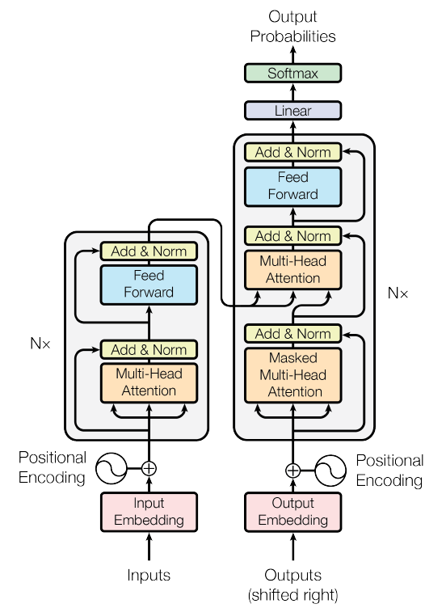

## The Original Transformer (Tensorflow)
This repo contains Tensorflow implementation of the original transformer paper (:link: [Vaswani et al.](https://arxiv.org/abs/1706.03762)).  
Check out my 10 part LLM Blog series on (:link: [Medium](https://medium.com/@zaiinn440))
## Table of Contents
  * [What are transformers?](#what-are-transformers)
  * [Machine translation](#machine-translation)
  * [Setup](#setup)

## What are transformers

Transformers were originally proposed by Vaswani et al. in a seminal paper called [Attention Is All You Need](https://arxiv.org/pdf/1706.03762.pdf).

You probably heard of transformers one way or another. **GPT-3 and BERT** to name a few well known ones :unicorn:. The main idea
is that they showed that you don't have to use recurrent or convolutional layers and that simple architecture coupled with attention is super powerful. It
gave the benefit of **much better long-range dependency modeling** and the architecture itself is highly **parallelizable** which leads to better compute efficiency!

Here is how their beautifully simple architecture looks like:

### Positional Encodings

### Custom Learning Rate Schedule

### Label Smoothing

## Machine translation

Transformer was originally trained for the NMT (neural machine translation) task on the [WMT-14 dataset](https://torchtext.readthedocs.io/en/latest/datasets.html#wmt14) for:
* English to German translation task (achieved 28.4 [BLEU score](https://en.wikipedia.org/wiki/BLEU))
* English to French translation task (achieved 41.8 BLEU score)
 

---

## Setup

So we talked about what transformers are, and what they can do for you (among other things).  
Let's get this thing running! Follow the next steps:

1. `git clone https://github.com/abideenml/TransformerImplementationfromScratch`
2. Open Anaconda console and navigate into project directory `cd path_to_repo`
3. Run `conda env create` from project directory (this will create a brand new conda environment).
4. Run `activate transformer` (for running scripts from your console or set the interpreter in your IDE)

That's it! It should work out-of-the-box executing environment.yml file which deals with dependencies. <br/

-----

### Training

To run the training start the `training_script.py`, there is a couple of settings you will want to specify:
* `--batch_size` - this is important to set to a maximum value that won't give you CUDA out of memory
* `--dataset_name` - Pick between `IWSLT` and `WMT14` (WMT14 is not advisable [until I add](#todos) multi-GPU support)
* `--language_direction` - Pick between `E2G` and `G2E`

So an example run (from the console) would look like this:  
`python training_script.py --batch_size 1500 --dataset_name IWSLT --language_direction G2E`

The code is well commented so you can (hopefully) understand how the training itself works.  

The script will:
* Dump checkpoint *.pth models into `models/checkpoints/`
* Dump the final *.pth model into `models/binaries/`
* Download IWSLT/WMT-14 (the first time you run it and place it under `data/`)
* Dump [tensorboard data](#evaluating-nmt-models) into `runs/`, just run `tensorboard --logdir=runs` from your Anaconda
* Periodically write some training metadata to the console

*Note: data loading is slow in torch text, and so I've implemented a custom wrapper which adds the caching mechanisms
and makes things ~30x faster! (it'll be slow the first time you run stuff)*

### Inference (Translating)

The second part is all about playing with the models and seeing how they translate!  
To get some translations start the `translation_script.py`, there is a couple of settings you'll want to set:
* `--source_sentence` - depending on the model you specify this should either be English/German sentence
* `--model_name` - one of the pretrained model names: `iwslt_e2g`, `iwslt_g2e` or your model(*)
* `--dataset_name` - keep this in sync with the model, `IWSLT` if the model was trained on IWSLT
* `--language_direction` - keep in sync, `E2G` if the model was trained to translate from English to German

(*) Note: after you train your model it'll get dumped into `models/binaries` see what it's name is and specify it via
the `--model_name` parameter if you want to play with it for translation purpose. If you specify some of the pretrained
models they'll **automatically get downloaded** the first time you run the translation script.

### Evaluating NMT models

I tracked 3 curves while training:
* training loss (KL divergence, batchmean)
* validation loss (KL divergence, batchmean)
* BLEU-4 

[BLEU is an n-gram based metric](https://www.aclweb.org/anthology/P02-1040.pdf) for quantitatively evaluating the quality of machine translation models.  
I used the BLEU-4 metric provided by the awesome **nltk** Python module.

Current results, models were trained for 20 epochs (DE stands for Deutch i.e. German in German :nerd_face:):

| Model | BLEU score | Dataset |
| --- | --- | --- |
| [Baseline transformer (EN-DE)](https://www.dropbox.com/s/a6pfo6t9m2dh1jq/iwslt_e2g.pth?dl=1) | **27.8** | IWSLT val |
| [Baseline transformer (DE-EN)](https://www.dropbox.com/s/dgcd4xhwig7ygqd/iwslt_g2e.pth?dl=1) | **33.2** | IWSLT val |
| Baseline transformer (EN-DE) | x | WMT-14 val |
| Baseline transformer (DE-EN) | x | WMT-14 val |

I got these using greedy decoding so it's a pessimistic estimate, I'll add beam decoding [soon.](#todos)

**Important note:** Initialization matters a lot for the transformer! I initially thought that other implementations
using Xavier initialization is again one of those arbitrary heuristics and that PyTorch default init will do - I was wrong:

You can see here 3 runs, the 2 lower ones used PyTorch default initialization (one used `mean` for KL divergence
loss and the better one used `batchmean`), whereas the upper one used **Xavier uniform** initialization!
 
---

### Visualizing attention

You can use the `translation_script.py` and set the `--visualize_attention` to True to additionally understand what your
model was "paying attention to" in the source and target sentences.

Here are the attentions I get for the input sentence `Ich bin ein guter Mensch, denke ich.`

These belong to layer 6 of the encoder. You can see all of the 8 multi-head attention heads.

And this one belongs to decoder layer 6 of the self-attention decoder MHA (multi-head attention) module.  
You can notice an interesting **triangular pattern** which comes from the fact that target tokens can't look ahead!

The 3rd type of MHA module is the source attending one and it looks similar to the plot you saw for the encoder.  

## Acknowledgements

I found these resources useful (while developing this one):

* [The Annotated Transformer](http://nlp.seas.harvard.edu/2018/04/03/attention.html)
* [PyTorch official implementation](https://github.com/pytorch/pytorch/blob/187e23397c075ec2f6e89ea75d24371e3fbf9efa/torch/nn/modules/transformer.py)

## Connect with me

* Follow me on [LinkedIn](https://www.linkedin.com/in/zaiinulabideen/)
* Follow me on [Medium](https://medium.com/@zaiinn440) :books: :heart:

## Licence

